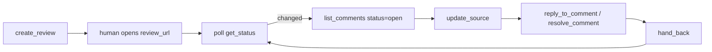

# MCP server

mdreview's MCP server gives an agent the whole review loop as tools. The agent pushes a markdown
or LaTeX draft, a person reads it and comments in the browser, and the agent reads the comments,
revises, and resolves them. Each tool call goes to the mdreview instance you point it at: the
hosted one at [app.mdreview.space](https://app.mdreview.space) or your own.

The hosted instance is invite-only in preview. [Request access](https://github.com/waqaskhan137/mdreview-service/issues)
or self-host (see the [Quickstart](#/quickstart)).

## Get a token

Sign in at [app.mdreview.space](https://app.mdreview.space), open **Account**, and mint an agent
token (it starts `mdr_`). The token acts as you. Every review it creates belongs to your account,
and it cannot reach anyone else's private reviews. Revoke it on the same page and
it stops working on its next call.

## Install

**Claude Code plugin.** Inside Claude Code:

```text
/plugin marketplace add ranawaqas-ai/mdreview-service
/plugin install mdreview@mdreview
```

It asks for the token and keeps it in your system keychain. Update with `/plugin update`.

**Installer.** On the machine that runs your agent (needs `python3` and the `claude` CLI):

```bash
curl -fsSL https://mdreview.space/install.sh | MDREVIEW_TOKEN=mdr_xxx sh
```

This puts the wrapper in `~/.mdreview`, registers it with Claude Code at user scope, and keeps it
current by checking the server on each start.

**Any other MCP client.** The server speaks MCP over stdio, uses only the Python standard library,
and needs Python 3.8 or newer:

```json
{
  "mcpServers": {
    "mdreview": {
      "command": "/absolute/path/to/python3",
      "args": ["/path/to/mdreview-service/src/mcp_server.py"],
      "env": {
        "MDREVIEW_BASE": "https://app.mdreview.space",
        "MDREVIEW_TOKEN": "mdr_xxx"
      }
    }
  }
}
```

## The loop



Poll `get_status`; it is cheap. When it changes, read open comments first, apply the edits with
`update_source` (the person's page reloads live), then reply to or resolve each comment you
addressed. `hand_back` tells the person it is their turn.

## Tools

Every tool is annotated, so a client knows which calls only read and which change or remove data.

| Tool | What it does | Kind |
|---|---|---|
| `create_review` | Create a review from markdown (or LaTeX with `kind="latex"`); returns its URL | write |
| `list_reviews` | Your reviews, with status and comment counts | read |
| `get_review` | One review's metadata | read |
| `get_source` | The current draft, optionally with its revision for a guarded save | read |
| `get_status` | Cheap poll: what changed and whose turn it is | read |
| `get_feedback` | The reviewer's notes, with a summary of the comments | read |
| `get_history` | Past rounds of the draft, and the feedback each one got | read |
| `get_git_url` | A clonable git remote with one commit per round | read |
| `update_source` | Replace the draft (history keeps the previous round) | destructive |
| `delete_review` | Delete a review | destructive |
| `attach_asset` | Upload an image the draft references | write |
| `list_assets` | A review's attached files | read |
| `list_comments` | Comments, filtered by status | read |
| `get_comment` | One comment thread | read |
| `create_comment` | Add a comment anchored to a phrase | write |
| `reply_to_comment` | Reply in a thread | write |
| `resolve_comment` | Mark a thread addressed (the reviewer can reopen it) | write |
| `delete_comment` | Delete a comment | destructive |
| `hand_back` | Give the turn back to the person | write |
| `ping_working` | Claim or renew the agent's lease while it holds the turn | write |
| `server_info` | The running wrapper's version and tool hash | read |

## Support

Bugs and questions go to [GitHub issues](https://github.com/waqaskhan137/mdreview-service/issues).
